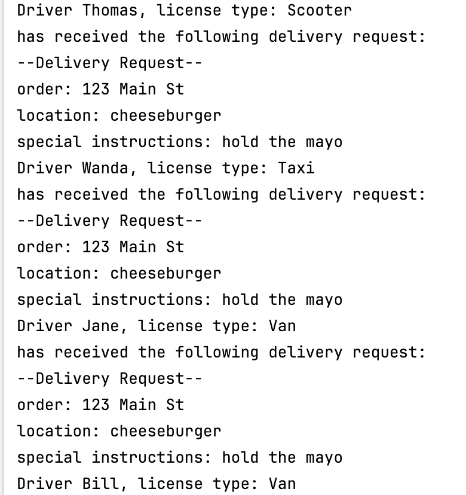

| CS-665       | Software Design & Patterns |
|--------------|----------------------------|
| Name         | ALESSANDRO ALLEGRANZI      |
| Date         | 02/22/2024                 |
| Course       | Spring                     |
| Assignment # | 2                          |

# Assignment Overview

This application implements a notification system for a network of retailers and local freelance drivers in a bustling city. 
The system aims to streamline the process of delivering products to customer destinations by generating and dispatching delivery requests to available van, taxi, and scooter drivers. 

Application requirements from the assignment:\
● Classes for Shop, DeliveryRequest, and Driver must be incorporated into your
implementation.\
● To test your solution, create an instance of Shop, a DeliveryRequest, and a minimum
of 5 Driver objects.\
● During testing, broadcast a single Delivery Request and send notifications to all Drivers
regarding the delivery.\

I have created the above classes using the Observer design pattern. The Shop class implements a ShopPublisher interface, and is the observable. The Driver class implements
the DriverSubscriber interface, and is the observer. The DeliveryRequest class I built out is standalone, but contains useful information for a delivery, like
address.

The application does not have any CLI or UI interaction, but running the Main class will output some sample text. The Main class builds out the Shop observer and creates 5 drivers subscribed to the shop.
It then creates a hardcoded delivery request and notifies all subscribed drivers.

Example Screenshot:



# GitHub Repository Link:
https://github.com/1-8192/bu_cs_665_assignment_2_allegranzi

# Implementation Description 


For each assignment, please answer the following:

- Explain the level of flexibility in your implementation, including how new object types can
be easily added or removed in the future.

The use of interfaces makes this implementation very flexible. Adding a new publisher and subscriber is a matter of
implementing the appropriate interface, which has a clear, simple contract. Adding new drivers as subscribers is also very simple
using the observer pattern set up in the code; it is just a matter of calling the subscribe() method on a shop.

In addition, the Vehicle interface makes it easier to implement new driver vehicles in the future. For example, a motorcycle
class could implement the interface, and would then be easy to plug into a new driver instance as their vehicle.

- Discuss the simplicity and understandability of your implementation, ensuring that it is
easy for others to read and maintain.

The classes I have constructed are fairly light-weight, and therefore readable and simple. The observer and strategy patterns I implemented are
both well-documented and the interface/class relationships are easy to read and understand. I have also included a good amount of unit test
coverag to test the implementation and provide another layer of logic documentation.

- Describe how you have avoided duplicated code and why it is important.

Avoiding duplicate code is very important to keep applications readable and light-weight. Convoluted code can also make
maintenance more difficult long term, as spotting and fixing bus can be a headache.

My use of classes and interfaces has cut down on duplicate code needed to otherwise run the application in a more
hardcoded style. The observer pattern makes it easy to publish events for subscribers to receive, rather than having to write 
individual state updates for unrelated classes. The strategy pattern also reduced the number of very similar and basically duplicate
driver classes I would have had to create.

- If applicable, mention any design patterns you have used and explain why they were
chosen.

The main design pattern I implemented for this assignment is the observer pattern. The assignment requirements clearly ask for
a central object that sends out dispatches to multiple listeners, so it is a classic use case for the observer pattern. I implemented a "push"
solution where the central observable object sends out notices to all of its observers. The ShopPublisher class is the observable interface, and features a
subscribe() method and notifySubscriber() method. The Shop class is the concrete observable class. DriverSubscriber is the observer interface, and the Driver
class is the concrete observer. When a shop received a new delivery request, it automatically published the request to all subscribed drivers via the
notifySubscribers() method call inside the setDeliveryRequest() method.


I also applied the strategy pattern to fulfill the assignment description of drivers differentiated by vehicle type. The application requirements and design did not 
strictly call for this pattern, but I used it in assignment 1 and thought it was a good, lighter-weight alternative to inheritance. Using the Strategy pattern, rather than creating
distinct classes for TaxiDriver, VanDriver, etc., the single Driver class requires a vehicle type that implements the Vehicle interface. Because Driver instances are otherwie identical, I think it is
a more readable design that a larger number of disparate driver classes that do the same thing. It might not be necessary, but the 
gang of four recommends to favor composition over inheritance.

# Maven Commands

We'll use Apache Maven to compile and run this project. You'll need to install Apache Maven (https://maven.apache.org/) on your system. 

Apache Maven is a build automation tool and a project management tool for Java-based projects. Maven provides a standardized way to build, package, and deploy Java applications.

Maven uses a Project Object Model (POM) file to manage the build process and its dependencies. The POM file contains information about the project, such as its dependencies, the build configuration, and the plugins used for building and packaging the project.

Maven provides a centralized repository for storing and accessing dependencies, which makes it easier to manage the dependencies of a project. It also provides a standardized way to build and deploy projects, which helps to ensure that builds are consistent and repeatable.

Maven also integrates with other development tools, such as IDEs and continuous integration systems, making it easier to use as part of a development workflow.

Maven provides a large number of plugins for various tasks, such as compiling code, running tests, generating reports, and creating JAR files. This makes it a versatile tool that can be used for many different types of Java projects.

## Compile
Type on the command line: 

```bash
mvn clean compile
```


## JUnit Tests
JUnit is a popular testing framework for Java. JUnit tests are automated tests that are written to verify that the behavior of a piece of code is as expected.

In JUnit, tests are written as methods within a test class. Each test method tests a specific aspect of the code and is annotated with the @Test annotation. JUnit provides a range of assertions that can be used to verify the behavior of the code being tested.

JUnit tests are executed automatically and the results of the tests are reported. This allows developers to quickly and easily check if their code is working as expected, and make any necessary changes to fix any issues that are found.

The use of JUnit tests is an important part of Test-Driven Development (TDD), where tests are written before the code they are testing is written. This helps to ensure that the code is written in a way that is easily testable and that all required functionality is covered by tests.

JUnit tests can be run as part of a continuous integration pipeline, where tests are automatically run every time changes are made to the code. This helps to catch any issues as soon as they are introduced, reducing the need for manual testing and making it easier to ensure that the code is always in a releasable state.

To run, use the following command:
```bash
mvn clean test
```


## Spotbugs 

SpotBugs is a static code analysis tool for Java that detects potential bugs in your code. It is an open-source tool that can be used as a standalone application or integrated into development tools such as Eclipse, IntelliJ, and Gradle.

SpotBugs performs an analysis of the bytecode generated from your Java source code and reports on any potential problems or issues that it finds. This includes things like null pointer exceptions, resource leaks, misused collections, and other common bugs.

The tool uses data flow analysis to examine the behavior of the code and detect issues that might not be immediately obvious from just reading the source code. SpotBugs is able to identify a wide range of issues and can be customized to meet the needs of your specific project.

Using SpotBugs can help to improve the quality and reliability of your code by catching potential bugs early in the development process. This can save time and effort in the long run by reducing the need for debugging and fixing issues later in the development cycle. SpotBugs can also help to ensure that your code is secure by identifying potential security vulnerabilities.

Use the following command:

```bash
mvn spotbugs:gui 
```

For more info see 
https://spotbugs.readthedocs.io/en/latest/maven.html

SpotBugs https://spotbugs.github.io/ is the spiritual successor of FindBugs.


## Checkstyle 

Checkstyle is a development tool for checking Java source code against a set of coding standards. It is an open-source tool that can be integrated into various integrated development environments (IDEs), such as Eclipse and IntelliJ, as well as build tools like Maven and Gradle.

Checkstyle performs static code analysis, which means it examines the source code without executing it, and reports on any issues or violations of the coding standards defined in its configuration. This includes issues like code style, code indentation, naming conventions, code structure, and many others.

By using Checkstyle, developers can ensure that their code adheres to a consistent style and follows best practices, making it easier for other developers to read and maintain. It can also help to identify potential issues before the code is actually run, reducing the risk of runtime errors or unexpected behavior.

Checkstyle is highly configurable and can be customized to fit the needs of your team or organization. It supports a wide range of coding standards and can be integrated with other tools, such as code coverage and automated testing tools, to create a comprehensive and automated software development process.

The following command will generate a report in HTML format that you can open in a web browser. 

```bash
mvn checkstyle:checkstyle
```

The HTML page will be found at the following location:
`target/site/checkstyle.html`

## Running the Application

### From an IDE
Open the Main.java class file, and using your IDE UI run the class. In IntelliJ there is a "play" button.


